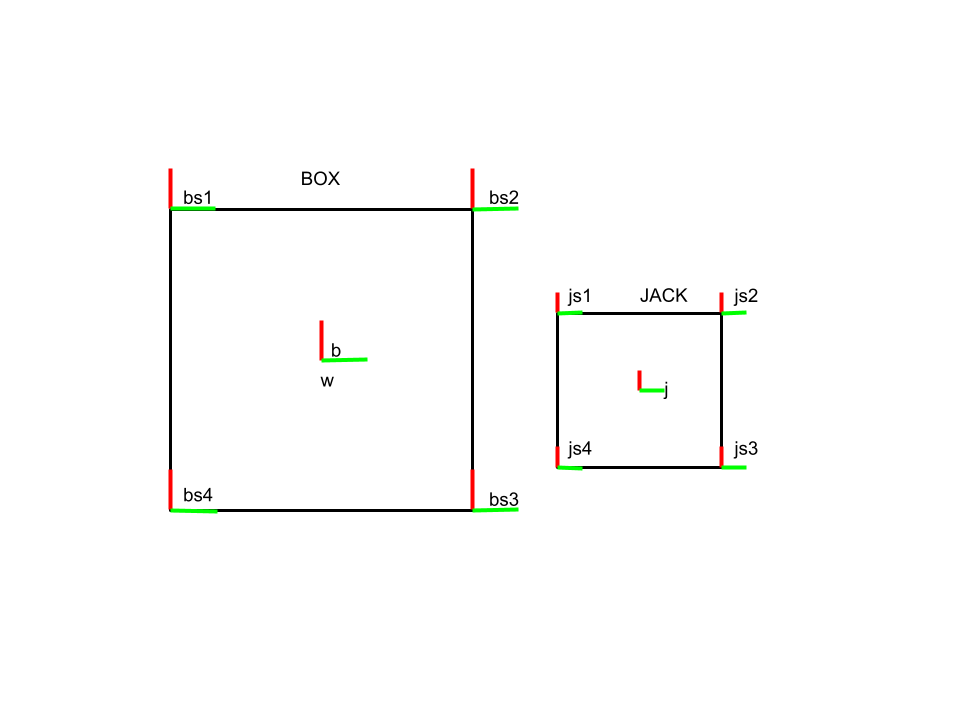

# ME314 Final Project: Box and Dice System

## Overview

This README provides an overview of the ME314 Final Project, focusing on the analysis and simulation of a box and dice system. The project involves deriving and solving Euler-Lagrange equations, considering system parameters, and simulating impacts between the box and dice.

## System Description

Illustrates the box and dice system with corresponding frames. The world frame {W} and box center frame {BC} are at the same location. BS1 and JS1 correspond to the first corner of the box and jack, respectively.

## System Parameters

- Mass of box: 20
- Mass of jack: 1
- Length of box: 10
- Length of jack: 1

## Euler-Lagrange Equations

1. Calculate the inertia tensor I for both the box and dice.
2. Compute body angular velocities (Vb) for each object using respective world to box center {gw_b} and world to jack center {gw_j} frames.
3. Calculate rotational kinetic energy (KE) of the system.

## Lagrangian and Euler-Lagrange Equations

1. Compute potential energy (V) using y-values of {gw_bc} and {gw_dc}.
2. Generate the Lagrangian L = KE - V.
3. Use the Lagrangian to calculate Euler-Lagrange (EL) equations.

## System Configuration and Impacts

- The system configuration q includes x-coordinate, y-coordinate, and theta rotation for each object.
- External forces: Vertical force (Fyb) and horizontal force (Fthetab) on the box.

## Impact Calculation

- Define impacts as corners of the die coming into contact with a side of the box.
- Calculate impacts using transforms shown in Figure 2.
- Check for impacts along the y-axis of the box corner frame.
- 16 total impacts to check (4 sides of the box for each of the 4 die corners).

## Simulation Results

- Trajectory generation with impacts.
- Plot and animate the simulation.
- The die bounces repeatedly up and down, gradually decreasing in overall y-value.
- Proper impacts on all sides of the box.
- Applied forces on the box (Fyb and Fthetab) may slightly alter box dynamics.

## Conclusion

The simulation successfully captures the dynamics of the box and dice system, considering impacts and external forces. Further analysis may be needed to fine-tune the applied forces on the box for more accurate simulation results.

Feel free to adjust the README to better fit your project structure and specific details.
